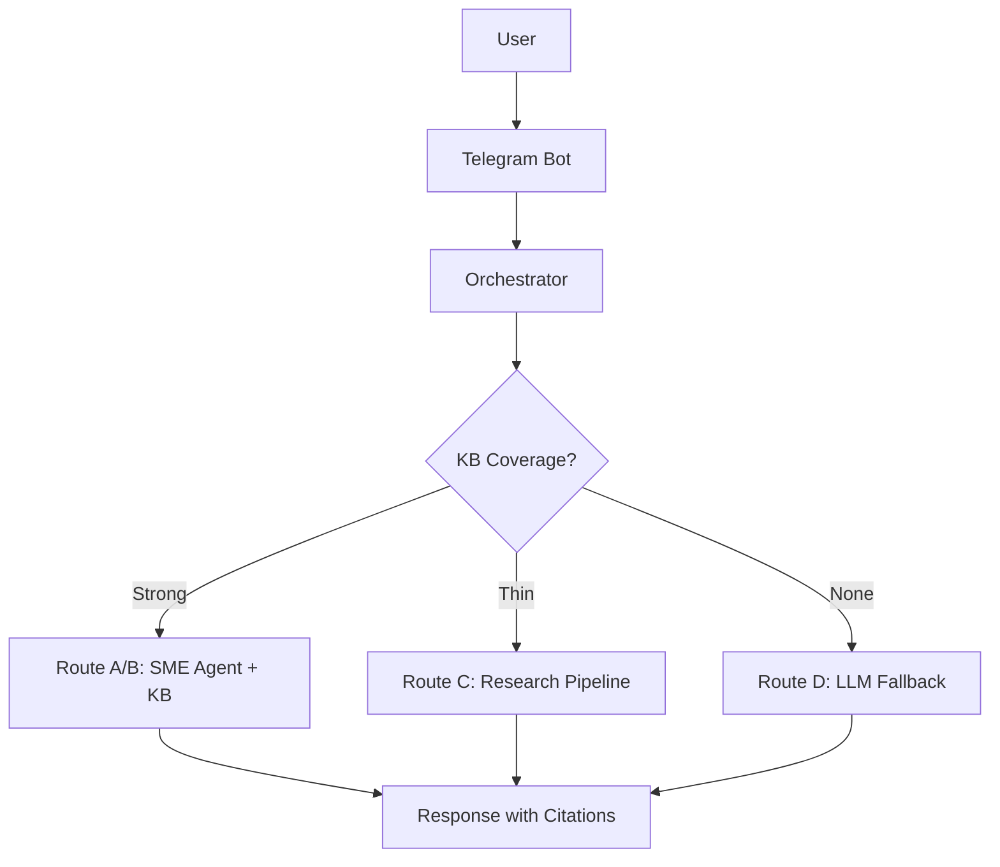

# Prompt

You are documenting the current session's work and committing to git.

When invoked, automatically:

## 1. Analyze Git Changes

Run these commands to detect changes:
```bash
git status --porcelain
git diff --stat
```

Parse the output to identify:
- Modified files (M prefix in git status)
- Added files (A or ?? prefix)
- Deleted files (D prefix)
- Key files changed (top 3-5 by line count from diff --stat)

## 2. Append to docs/SESSION_LOG.md

Read CURRENT_STATE.md and NEXT_ACTIONS.md for context.

Append this format to docs/SESSION_LOG.md:
```markdown
## [YYYY-MM-DD HH:MM]

**Changed:** [auto-detected from git diff --stat - top files with line counts]
**Summary:** [one-line summary inferred from file names and conversation context]
**Files:**
- [list of modified files from git status]
**Next:** [infer from NEXT_ACTIONS.md "Immediate Next Step" section]
```

Example:
```markdown
## 2025-12-22 18:45

**Changed:** retriever.py (+15/-8), filters.py (+24/-3), CURRENT_STATE.md (+78/-388)
**Summary:** Fixed KB search to use manufacturer column instead of vendor
**Files:**
- agent_factory/rivet_pro/rag/retriever.py
- agent_factory/rivet_pro/rag/filters.py
- CURRENT_STATE.md
**Next:** Test Phase 1 KB search fix with Telegram photo upload
```

## 3. Update docs/STATE.md (overwrite completely)

Read CURRENT_STATE.md for "Working" features.
Read NEXT_ACTIONS.md for "Immediate Next Step".

Write this format to docs/STATE.md (overwrite):
```markdown
# State: [YYYY-MM-DD]

## Working
[Extract from CURRENT_STATE.md "✅ Working (Production)" section - bullet list]

## Next
[Extract from NEXT_ACTIONS.md "## Immediate Next Step" section]

## Map

```

Example STATE.md:
```markdown
# State: 2025-12-22

## Working
- Photo OCR Handler (GPT-4o Vision API)
- KB Search (Phase 1 complete - manufacturer column fix)
- LLM Routing (73% cost reduction)
- Telegram Bot (orchestrator-bot.service running on VPS)

## Next
- Test Phase 1 KB Search Fix
- Send photo of equipment nameplate via Telegram
- Verify KB search returns > 0 atoms
- Check if Route A/B responses now work (instead of always Route C)

## Map

```

## 4. Git Commit

Stage all changes and commit:
```bash
git add -A
git commit -m "save: [YYYY-MM-DD] - [auto-generated summary from top changed files]"
```

Example commit message:
```
save: 2025-12-22 - KB search column fix (retriever.py, filters.py)
```

## 5. Report Completion

After all steps complete, output:
```
Session saved ✓

📝 Session Log: docs/SESSION_LOG.md (appended)
📊 State Snapshot: docs/STATE.md (updated)
💾 Git Commit: [commit hash] save: [date] - [summary]

Files changed: [N]
Lines added: [N]
Lines removed: [N]
```

## Success Criteria
- [ ] Git changes auto-detected (git status, git diff)
- [ ] docs/SESSION_LOG.md appended (chronological entry)
- [ ] docs/STATE.md overwritten (current snapshot)
- [ ] Auto-commit successful with descriptive message
- [ ] Runs in <10 seconds

## Error Handling

If git repo is dirty with merge conflicts:
- Report error: "Cannot save: merge conflicts detected. Resolve conflicts first."
- Do NOT commit

If no changes detected:
- Report: "No changes to save. Working tree clean."
- Do NOT create empty commit

If CURRENT_STATE.md or NEXT_ACTIONS.md missing:
- Use fallback: "Unable to read context files. Using git changes only."
- Still append to SESSION_LOG.md with limited info

## Notes

- This command stages ALL changes (git add -A), including untracked files
- If you want selective staging, commit manually before running /save
- SESSION_LOG.md is append-only (chronological history)
- STATE.md is overwritten each session (current snapshot)
- Integrates with existing docs: CURRENT_STATE.md, NEXT_ACTIONS.md, DECISIONS_LOG.md
