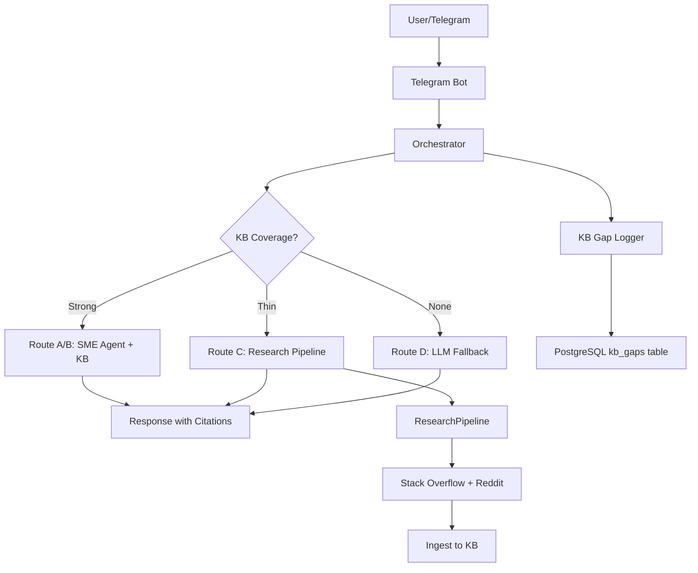

# State: 2025-12-22

## Working
- Photo OCR Handler (GPT-4o Vision API extracts manufacturer, model, serial number)
- KB Search (Phase 1 complete - retriever uses manufacturer column)
- VENDOR_TO_MANUFACTURER mapping for 9 vendors
- 1,964 knowledge atoms loaded in database
- LLM Routing (73% cost reduction vs baseline)
- Groq fallback for Routes C/D
- OpenAI fallback if Groq fails
- Telegram Bot (orchestrator-bot.service running on VPS 72.60.175.144)
- Two-message pattern (user response + admin debug trace)

## Next
- Test Phase 1 KB Search Fix
- Send photo of equipment nameplate via Telegram
- Verify KB search returns > 0 atoms
- Check if Route A/B responses now work (instead of always Route C)

If test succeeds → Phase 2: Expand Vendor Detection
If test fails → Debug why manufacturer filter isn't finding atoms

## Map

