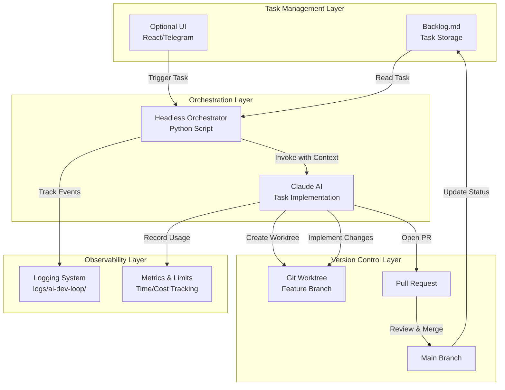
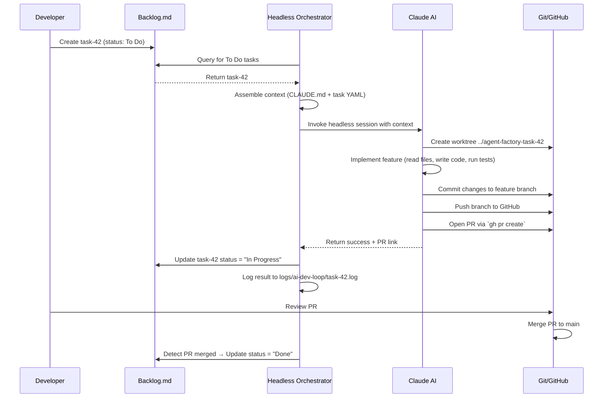
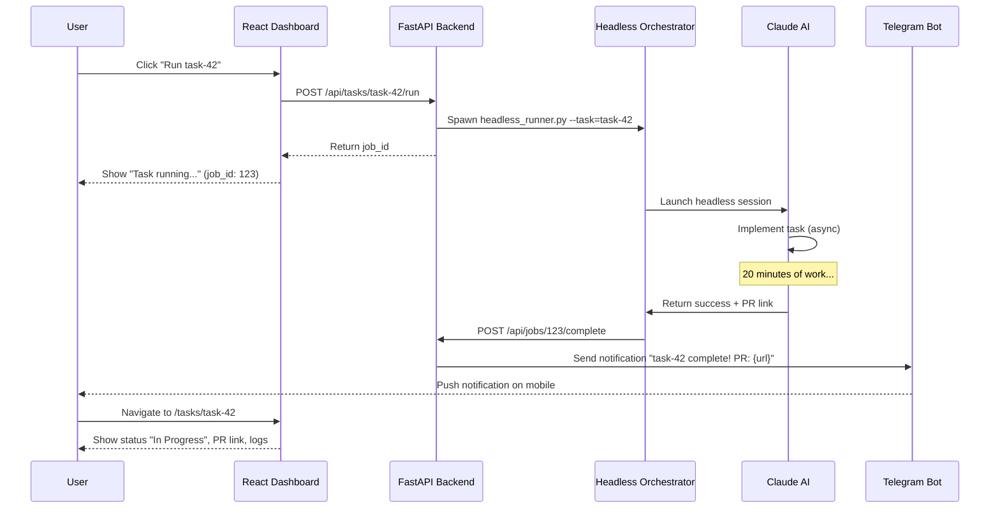

# AI Dev Control Loop Architecture

## Overview

The **AI Dev Control Loop** is an autonomous development system where AI agents (powered by Claude) implement software tasks defined in Backlog.md without human intervention. The system operates as a closed loop:

1. **Task Definition** → Developer creates task in Backlog.md with acceptance criteria
2. **Autonomous Execution** → Headless orchestrator invokes Claude to implement the task
3. **Automated PR** → Claude creates git worktree, implements changes, opens pull request
4. **Human Review** → Developer reviews PR and merges (or requests changes)
5. **Status Update** → Backlog.md task status auto-updates to "Done"

**Key Insight:** The AI doesn't just assist development—it becomes a member of the development team, consuming tasks from the backlog just like a human developer would.

## System Architecture

### Component Diagram



## Core Components

### 1. Backlog.md (Task Storage)

**Location:** `backlog/tasks/*.md`

**Purpose:** Source of truth for all development tasks

**Task Format (YAML + Markdown):**
```markdown
---
id: task-42
title: 'BUILD: Add user authentication'
status: To Do
assignee: []
created_date: '2025-12-17 10:00'
updated_date: '2025-12-17 10:00'
labels:
  - build
  - security
dependencies: [task-38]
parent_task_id: task-40
priority: high
---

## Description

Implement JWT-based authentication for API endpoints.

## Acceptance Criteria
- [ ] #1 POST /auth/login returns JWT token
- [ ] #2 Protected endpoints validate JWT
- [ ] #3 Token expiry set to 24 hours
```

**Key Fields for AI Loop:**
- `id`: Unique task identifier (e.g., task-42)
- `status`: To Do → In Progress → Done (AI updates this)
- `dependencies`: Tasks that must complete first
- `priority`: high/medium/low (affects scheduling)
- Acceptance Criteria: AI validates against these before marking Done

**Instructions Files (Context for AI):**
- `CLAUDE.md`: System instructions, coding standards, architecture patterns
- `AGENTS.md`: Agent-specific instructions (if task assigns to specific agent)
- `backlog/README.md`: Backlog.md workflow guide

### 2. Headless Orchestrator

**File:** `scripts/autonomous/headless_runner.py`

**Purpose:** Automates the task execution loop

**Key Responsibilities:**
1. **Task Selection** - Query Backlog.md for tasks matching criteria (status="To Do", priority="high")
2. **Context Assembly** - Gather relevant context (CLAUDE.md, dependencies, codebase files)
3. **Claude Invocation** - Launch Claude CLI with task prompt in headless mode
4. **Worktree Management** - Create/cleanup git worktrees for isolated feature work
5. **PR Creation** - Open pull requests via GitHub CLI when implementation complete
6. **Status Sync** - Update Backlog.md task status based on outcome

**Invocation:**
```bash
# Run specific task
BACKLOG_TASK_ID=task-42 python scripts/autonomous/headless_runner.py

# Run next high-priority task
python scripts/autonomous/headless_runner.py --auto-select

# Run all "To Do" tasks (danger mode!)
python scripts/autonomous/headless_runner.py --batch --max-tasks=10
```

**Configuration (Environment Variables):**
```bash
BACKLOG_TASK_ID=task-42           # Explicit task selection
AI_DEV_LOOP_TIME_LIMIT=1800       # Max 30 min per task
AI_DEV_LOOP_COST_LIMIT=5.00       # Max $5 API cost per task
AI_DEV_LOOP_LOG_DIR=logs/ai-dev-loop/
CLAUDE_MODEL=claude-sonnet-4.5    # Model to use
```

### 3. Claude AI (Task Implementation)

**Execution Mode:** Headless Claude CLI (non-interactive)

**Input Context:**
```
<system_prompt>
You are implementing task-42 from Backlog.md.

TASK DETAILS:
{task_yaml_content}

ACCEPTANCE CRITERIA:
{parsed_acceptance_criteria}

CODEBASE CONTEXT:
{relevant_files_from_dependencies}

INSTRUCTIONS:
{CLAUDE.md_content}

Your goal: Implement the task, validate against acceptance criteria, create PR.
</system_prompt>
```

**Tool Access (Restricted):**
- ✅ Read/Write files
- ✅ Bash (for git, tests, linting)
- ✅ Create git worktree
- ✅ Open PR via `gh pr create`
- ❌ NO internet access (WebFetch/WebSearch disabled for safety)
- ❌ NO destructive git commands (force push, hard reset)
- ❌ NO writes outside worktree directory

**Safety Guardrails:**
1. **Time Limit:** Claude session auto-terminates after 30 minutes
2. **Cost Limit:** Session stops if API cost exceeds $5
3. **Approval Gates:** Cannot merge PR (only create it)
4. **Sandbox:** Works in isolated worktree, can't affect main branch directly

**Output:**
- Feature branch with implemented changes
- Pull request with acceptance criteria checklist
- Log file in `logs/ai-dev-loop/{task_id}_{timestamp}.log`

### 4. Git Worktree Strategy

**Purpose:** Isolate AI work from main codebase to prevent conflicts

**Directory Structure:**
```
C:\Users\hharp\OneDrive\Desktop\
├── Agent Factory\              # Main repo (NEVER work here directly)
│   ├── backlog/
│   ├── docs/
│   └── agent_factory/
├── agent-factory-task-42\      # Worktree for task-42
│   ├── .git -> Agent Factory/.git/worktrees/agent-factory-task-42
│   └── [full codebase copy with feature branch checked out]
└── agent-factory-task-43\      # Worktree for task-43 (parallel work)
```

**Workflow:**
```bash
# 1. Orchestrator creates worktree
git worktree add ../agent-factory-task-42 -b ai-dev-loop/task-42

# 2. Claude works in worktree
cd ../agent-factory-task-42
# ... make changes ...
git add .
git commit -m "feat: Implement user authentication (task-42)"
git push -u origin ai-dev-loop/task-42

# 3. Claude opens PR
gh pr create --title "feat: Add user authentication (task-42)" --body "..."

# 4. After PR merged, orchestrator cleans up
git worktree remove ../agent-factory-task-42
git branch -d ai-dev-loop/task-42
```

**Benefits:**
- **Parallel Execution:** Multiple tasks can run simultaneously in separate worktrees
- **Conflict Isolation:** AI mistakes can't break main codebase
- **Easy Cleanup:** Delete worktree to abandon work
- **No Stale Branches:** Main repo always clean

### 5. Optional UI Layers

**React Dashboard:**
- **Location:** `ui/ai-dev-loop-dashboard/` (future)
- **Features:** View tasks, trigger runs, see logs, monitor metrics
- **Tech Stack:** Next.js, React, Tailwind CSS
- **API:** FastAPI backend exposing Backlog.md data

**Telegram Bot:**
- **Integration:** Extend existing Agent Factory Telegram bot
- **Commands:**
  - `/ai_tasks` - List To Do tasks
  - `/ai_run task-42` - Trigger specific task
  - `/ai_status task-42` - Check task progress
  - `/ai_logs task-42` - View execution logs
- **Notifications:** Send PR link when task completes

**No UI = Still Works:**
The system is designed to work via cron/scheduler without any UI:
```bash
# Cron job runs every hour
0 * * * * cd /path/to/agent-factory && python scripts/autonomous/headless_runner.py --auto-select
```

## End-to-End Workflows

### Workflow 1: Task → Orchestrator → Claude → PR → Done



**Timeline:**
- T+0: Developer creates task
- T+5min: Orchestrator picks up task
- T+35min: Claude completes implementation (30min limit triggered)
- T+40min: PR opened
- T+60min: Developer reviews and merges
- T+65min: Task auto-marked Done

### Workflow 2: User Triggers Run from UI



**User Experience:**
1. One-click task execution
2. Real-time progress updates (via polling or WebSocket)
3. Mobile notifications on completion
4. Direct link to PR for review

## Safety & Observability

### Time Limits

**Purpose:** Prevent runaway AI sessions from consuming excessive resources

**Implementation:**
```python
# In headless_runner.py
import signal

def timeout_handler(signum, frame):
    raise TimeoutError("AI session exceeded 30 minute limit")

signal.signal(signal.SIGALRM, timeout_handler)
signal.alarm(1800)  # 30 minutes

try:
    run_claude_session(task_id)
except TimeoutError:
    log_error(f"Task {task_id} timed out after 30 minutes")
    update_task_status(task_id, "Blocked", note="Timeout - task too complex")
```

**Configurable Limits:**
- Default: 30 minutes per task
- Override: `AI_DEV_LOOP_TIME_LIMIT=3600` (60 min for complex tasks)
- Maximum: 2 hours (hard cap)

### Cost Limits

**Purpose:** Prevent expensive API calls for tasks that don't converge

**Implementation:**
```python
# Track API usage during session
from anthropic import Anthropic

client = Anthropic()
total_cost = 0.0

def track_usage(response):
    input_tokens = response.usage.input_tokens
    output_tokens = response.usage.output_tokens
    cost = (input_tokens * 0.003 / 1000) + (output_tokens * 0.015 / 1000)  # Sonnet pricing

    global total_cost
    total_cost += cost

    if total_cost > 5.00:
        raise BudgetExceededError(f"Task exceeded $5 cost limit (${total_cost:.2f})")
```

**Cost Tracking:**
- Log cost per task to metrics database
- Alert if monthly AI dev costs exceed threshold
- Report: Which tasks are most expensive to implement

### Logging Strategy

**Directory:** `logs/ai-dev-loop/`

**Log Files:**
```
logs/ai-dev-loop/
├── task-42_2025-12-17_14-30-00.log     # Individual task execution
├── orchestrator.log                     # Orchestrator activity
├── errors.log                           # Failed tasks only
└── metrics.json                         # Cost/time metrics
```

**Log Format (JSON Lines):**
```json
{"timestamp": "2025-12-17T14:30:00Z", "task_id": "task-42", "event": "start", "model": "claude-sonnet-4.5"}
{"timestamp": "2025-12-17T14:35:00Z", "task_id": "task-42", "event": "worktree_created", "path": "../agent-factory-task-42"}
{"timestamp": "2025-12-17T14:50:00Z", "task_id": "task-42", "event": "test_passed", "test": "test_authentication"}
{"timestamp": "2025-12-17T15:00:00Z", "task_id": "task-42", "event": "pr_created", "pr_url": "https://github.com/..."}
{"timestamp": "2025-12-17T15:00:05Z", "task_id": "task-42", "event": "complete", "duration_sec": 1805, "cost_usd": 2.34}
```

**Retention:**
- Keep individual task logs for 90 days
- Keep aggregated metrics forever
- Compress logs older than 30 days

### Error Handling

**Failure Scenarios & Responses:**

| Error | Detection | Action |
|-------|-----------|--------|
| Task times out after 30 min | `signal.alarm()` triggers | Mark task "Blocked", add note "Timeout - likely too complex" |
| Tests fail during implementation | Claude detects test failures | Do NOT open PR, mark task "Blocked" with error details |
| API cost exceeds $5 | Cost tracking in callback | Terminate session, mark "Blocked", add note "Cost limit exceeded" |
| Merge conflict in PR | GitHub API detects conflict | Add comment to PR requesting human help, mark "In Progress" |
| Claude crashes mid-session | Process exit code != 0 | Log stack trace, mark "Blocked", alert developer |

**Circuit Breaker:**
```python
# If 3 consecutive tasks fail, pause orchestrator
consecutive_failures = 0

if task_result.status == "failed":
    consecutive_failures += 1
    if consecutive_failures >= 3:
        send_alert("AI Dev Loop: 3 consecutive failures, pausing orchestrator")
        sys.exit(1)  # Stop trying until human investigates
else:
    consecutive_failures = 0  # Reset on success
```

## Extensibility

### How to Add New Task Types

**Example: Add "SECURITY-AUDIT" task type**

1. **Update Backlog.md label schema:**
```yaml
labels:
  - security-audit
```

2. **Create specialized prompt in AGENTS.md:**
```markdown
## Security Audit Agent

When implementing tasks labeled "security-audit":
- Review code for OWASP Top 10 vulnerabilities
- Check for hardcoded secrets
- Validate input sanitization
- Ensure least-privilege access
- Run security linters (bandit, semgrep)
```

3. **Update orchestrator to route security tasks:**
```python
# In headless_runner.py
if "security-audit" in task.labels:
    context += load_file("AGENTS.md", section="Security Audit Agent")
    tools = ["Read", "Grep", "Bash(bandit:*)", "Bash(semgrep:*)"]  # Restrict to analysis tools
```

### How to Add New Repositories

**Example: Enable AI Dev Loop for "Friday" repo**

1. **Fork Backlog.md to new repo:**
```bash
cd /path/to/Friday
git clone https://github.com/Mikecranesync/backlog-md.git backlog
```

2. **Create repo-specific CLAUDE.md:**
```markdown
# CLAUDE.md (Friday repo)

## Context
Friday is a voice AI assistant for personal productivity.

## Architecture
- FastAPI backend (Python 3.10)
- React frontend (TypeScript)
- Voice engine: ElevenLabs API
- Memory: PostgreSQL + pgvector

## Standards
- All API routes must have authentication
- Voice responses max 30 seconds
- Test coverage minimum 80%
```

3. **Configure orchestrator for multi-repo:**
```bash
# .env
BACKLOG_REPOS=Agent-Factory,Friday,Jarvis
BACKLOG_REPO_Friday=/path/to/Friday
BACKLOG_REPO_Jarvis=/path/to/Jarvis
```

4. **Run orchestrator:**
```bash
# Run tasks from Friday repo only
python scripts/autonomous/headless_runner.py --repo=Friday
```

### How to Customize Agent Behavior

**Use Case: Make AI more conservative (fewer changes per task)**

**Method 1: Adjust system prompt in orchestrator:**
```python
# In headless_runner.py
conservative_prompt = """
You are implementing {task_id}.

IMPORTANT: Make minimal changes to accomplish the goal.
- Prefer editing existing files over creating new files
- Do not refactor code unless explicitly requested
- Do not add features beyond acceptance criteria
- If uncertain, mark task as "Blocked" and request human guidance
"""
```

**Method 2: Add pre-commit validation hooks:**
```python
# scripts/autonomous/validate_changes.py
def validate_pr_before_opening(worktree_path):
    # Check: Did AI modify more than 10 files?
    changed_files = run(["git", "diff", "--name-only", "main"], cwd=worktree_path)
    if len(changed_files.splitlines()) > 10:
        raise ValidationError("Too many files changed - likely scope creep")

    # Check: Did AI add more than 500 lines of code?
    stats = run(["git", "diff", "--stat", "main"], cwd=worktree_path)
    if extract_insertions(stats) > 500:
        raise ValidationError("Too many lines added - break into smaller tasks")
```

**Method 3: Use different models for different task types:**
```python
# Route complex architectural tasks to Opus, simple fixes to Haiku
if task.priority == "critical" or "architecture" in task.labels:
    model = "claude-opus-4.5"  # More capable but expensive
elif "fix" in task.labels or "typo" in task.labels:
    model = "claude-haiku-4.0"  # Fast and cheap for simple tasks
else:
    model = "claude-sonnet-4.5"  # Default balanced model
```

## Metrics & Monitoring

**Key Metrics to Track:**

1. **Success Rate:** % of tasks that result in merged PRs
2. **Time to Complete:** Median time from "To Do" → "Done"
3. **Cost per Task:** Average API cost to implement one task
4. **First-Time Success Rate:** % of PRs that merge without changes requested
5. **Blocked Task Rate:** % of tasks that fail and require human intervention

**Example Dashboard Queries:**
```sql
-- Success rate by task type
SELECT
    labels,
    COUNT(*) as total_tasks,
    SUM(CASE WHEN status = 'Done' THEN 1 ELSE 0 END) as completed,
    ROUND(100.0 * SUM(CASE WHEN status = 'Done' THEN 1 ELSE 0 END) / COUNT(*), 2) as success_rate
FROM backlog_tasks
WHERE created_date >= NOW() - INTERVAL '30 days'
GROUP BY labels
ORDER BY total_tasks DESC;

-- Most expensive tasks
SELECT
    task_id,
    title,
    cost_usd,
    duration_minutes
FROM ai_dev_loop_metrics
ORDER BY cost_usd DESC
LIMIT 10;
```

## Future Enhancements

**Phase 1 (MVP - Current Plan):**
- ✅ Headless orchestrator
- ✅ Git worktree automation
- ✅ Basic safety limits
- ✅ Logging

**Phase 2 (Advanced):**
- [ ] React dashboard UI
- [ ] Telegram bot integration
- [ ] Multi-repo support
- [ ] Cost/time metrics database

**Phase 3 (Intelligence):**
- [ ] Task prioritization AI (learn which tasks are urgent)
- [ ] Automatic dependency detection (parse code to find related tasks)
- [ ] Self-healing (if tests fail, AI debugs and retries)
- [ ] Learning from PR feedback (train on past reviews)

**Phase 4 (Autonomous Teams):**
- [ ] Multi-agent collaboration (one agent writes code, another reviews)
- [ ] Specialist agents (security expert, performance expert, UX expert)
- [ ] Agent swarms (10 agents work on 10 tasks simultaneously)
- [ ] Meta-learning (AI improves its own prompts based on success rate)

## References

**Related Documents:**
- `backlog/README.md` - Complete Backlog.md workflow guide
- `docs/patterns/GIT_WORKTREE_GUIDE.md` - Git worktree best practices
- `CLAUDE.md` - System instructions for AI agents
- `C:\Users\hharp\.claude\plans\ai-dev-loop-worktrees.md` - Worktree implementation strategy

**Inspiration:**
- Devin AI (Cognition Labs) - Autonomous software engineer
- AutoGPT - Self-directed AI agents
- Backlog.md (MrLesk) - Human-readable task management
- Claude Code CLI - Headless AI development tool

---

**Document Status:** Complete (satisfies task-23.3 acceptance criteria)
**Last Updated:** 2025-12-17
**Next Steps:** Implement headless runner (task-23.2)
