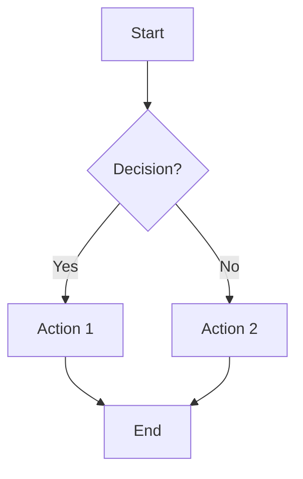
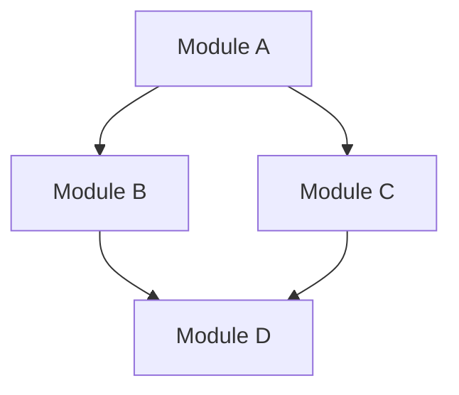
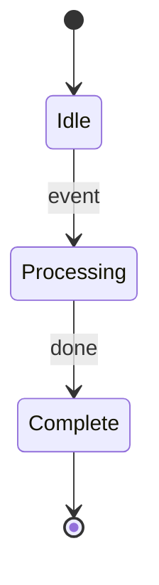
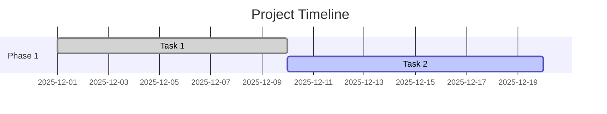
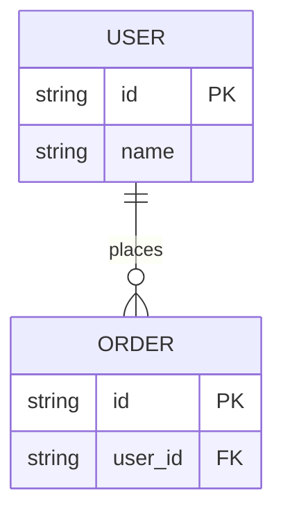
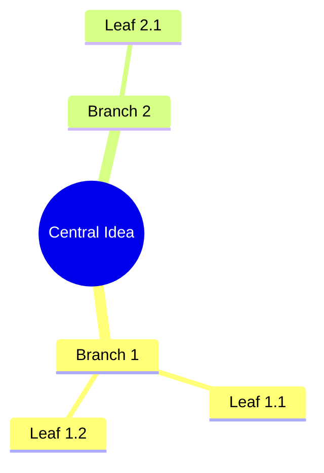

# Agent Factory Mermaid Diagrams

**Living documentation synchronized with code changes**

This directory contains 6 Mermaid diagrams that visualize the Agent Factory repository structure, architecture, and strategic roadmap. These diagrams are the **authoritative reference** for understanding the system and **must be kept synchronized** with code changes.

## Diagram Index

### [01. Execution Flow](repo-overview/01-execution-flow.md)
**Type:** Flowchart TD
**Purpose:** SCAFFOLD autonomous development loop (Backlog → Code → Test → PR → Merge)
**Update When:**
- Workflow changes (new steps in SCAFFOLD loop)
- New handlers added (beyond claude-code, manual)
- Routing logic modified
- Safety checks changed

**Key Insight:** Shows the **DiagramCheck enforcement point** that blocks PRs if diagrams aren't updated.

---

### [02. Architecture](repo-overview/02-architecture.md)
**Type:** Module Dependency Graph
**Purpose:** High-level system architecture (Core, SCAFFOLD, RIVET, Workflows, Agents)
**Update When:**
- ✅ **New module/package added** (MANDATORY)
- ✅ **Dependencies change** (MANDATORY)
- ✅ **Integration points added** (new MCP server, external service)

**Key Insight:** Most frequently updated diagram. If you add a new Python module, update this diagram.

---

### [03. Orchestrator States](repo-overview/03-orchestrator-states.md)
**Type:** State Diagram v2
**Purpose:** SCAFFOLD orchestrator state machine (Idle → Ready → Processing → DiagramCheck → PR → Cleanup)
**Update When:**
- ✅ **State transitions change** (MANDATORY)
- ✅ **New states added** (MANDATORY)
- Safety checks modified
- State machine refactored

**Key Insight:** Documents the **DiagramCheck state** that enforces synchronization.

---

### [04. Roadmap Timeline](repo-overview/04-roadmap-timeline.md)
**Type:** Gantt Chart
**Purpose:** Feature roadmap from Backlog.md (tasks, milestones, timelines)
**Update When:**
- ✅ **Task completed** (mark `done`)
- ✅ **Major milestone reached**
- Sprint planning complete
- Timeline changes

**Key Insight:** Auto-generate from Backlog.md periodically. Shows where we are vs. where we're going.

---

### [05. Data Model](repo-overview/05-data-model.md)
**Type:** ER Diagram (Entity-Relationship)
**Purpose:** Core entities and relationships (TASK, SESSION, WORKTREE, AGENT, etc.)
**Update When:**
- ✅ **New entity added** (class, dataclass, Pydantic model) (MANDATORY)
- ✅ **Relationship changes** (foreign keys, cardinality) (MANDATORY)
- ✅ **Key fields modified** (status enums, constraints)
- Schema migration

**Key Insight:** If you create a new dataclass, add it here.

---

### [06. Knowledge Map](repo-overview/06-knowledge-map.md)
**Type:** Mind Map
**Purpose:** Strategic concepts, subsystems, risks, opportunities (at a glance)
**Update When:**
- New strategic initiative announced
- Major architecture change
- New risk identified (security, scalability, cost)
- Opportunity discovered (new vertical, partnership)

**Key Insight:** High-level strategic reference for planning and prioritization.

---

## When to Update Diagrams

### ALWAYS Update (Blocks PR if missing)

| Change Type | Update These Diagrams | Why |
|-------------|----------------------|-----|
| New Python module/package | `02-architecture.md` | Module dependencies changed |
| New dataclass/entity | `05-data-model.md` | Data model changed |
| State machine changes | `03-orchestrator-states.md` | State transitions changed |
| Task completed | `04-roadmap-timeline.md` | Roadmap progress |
| New workflow step | `01-execution-flow.md` | Flow changed |

### SOMETIMES Update (Use judgment)

| Change Type | Update These Diagrams | Why |
|-------------|----------------------|-----|
| New MCP tool | `02-architecture.md`, `06-knowledge-map.md` | If significant integration |
| New agent | `02-architecture.md`, `06-knowledge-map.md` | If part of 18-agent system |
| Major refactor | `01-execution-flow.md`, `02-architecture.md` | Depends on scope |
| New strategic initiative | `06-knowledge-map.md`, `04-roadmap-timeline.md` | High-level changes |

### NEVER Update (Waste of time)

| Change Type | Reason |
|-------------|--------|
| Docstrings | No architectural impact |
| Bug fixes | No structural changes |
| Test additions | Unless testing new feature |
| Configuration | Unless new integration |
| Typos | Obviously |

---

## How to Update Diagrams

### 1. Edit the Diagram File

Open the relevant `.md` file in `docs/diagrams/repo-overview/` and edit the Mermaid code block.

**Example:** Adding a new module to architecture diagram:

```markdown
<!-- In 02-architecture.md -->

```mermaid
graph TD
    subgraph Core["Core Infrastructure"]
        AF[AgentFactory]
        DB[DatabaseManager]
        MEM[MemoryStorage]
        SET[SettingsService]
        NEW[NewModule<br/>description]  # ← Add this
    end

    NEW --> AF  # ← Add dependency
```
```

### 2. Validate on Mermaid.live

1. Copy the **entire Mermaid code block** (including ` ```mermaid ` tags)
2. Paste into [mermaid.live](https://mermaid.live)
3. Verify it renders correctly (no syntax errors)
4. Fix any issues

### 3. Commit with Code Changes

**CRITICAL:** Diagrams must be committed **in the same commit** as code changes.

```bash
git add agent_factory/new_module.py
git add docs/diagrams/repo-overview/02-architecture.md
git commit -m "BUILD: Add NewModule to Core

- Implemented NewModule class (150 lines)
- Integrated with AgentFactory
- Updated architecture diagram

Diagrams updated:
- ✅ 02-architecture.md (added NewModule to Core subgraph)
"
```

### 4. Include in PR Description

Use the PR template checklist (see `.github/pull_request_template.md`):

```markdown
## Diagram Sync Checklist

- [ ] No structural changes (skip remaining checks)
- [x] If new module/package: Updated `02-architecture.md`
- [ ] If state machine changes: Updated `03-orchestrator-states.md`
- [ ] If data model changes: Updated `05-data-model.md`
- [ ] If major milestone: Updated `04-roadmap-timeline.md`
- [x] Verified diagrams render correctly (mermaid.live)

## Diagrams Updated
- ✅ 02-architecture.md (added NewModule to Core subgraph)
- N/A 03-orchestrator-states.md (no changes)
- N/A 05-data-model.md (no changes)
```

---

## Mermaid Syntax Quick Reference

### Flowchart TD (Top-Down)


### Graph TD (Module Dependencies)


### State Diagram v2


### Gantt Chart


### ER Diagram


### Mind Map


---

## Enforcement Mechanisms

### 1. PR Template Checklist
- **File:** `.github/pull_request_template.md`
- **Purpose:** Mandatory diagram sync checklist
- **Enforcement:** Human reviewer verifies before approval

### 2. CI/CD Validation (Planned)
- **File:** `.github/workflows/diagram-validation.yml`
- **Purpose:** Automated Mermaid syntax validation + drift detection
- **Enforcement:** Warning (not error) posted as PR comment

### 3. SCAFFOLD Integration (Planned)
- **File:** `agent_factory/scaffold/result_processor.py`
- **Purpose:** Detect new modules, add PR comment if structural change
- **Enforcement:** Automated comment suggests diagram updates

---

## Diagram System Files

```
docs/diagrams/
├── README.md                          # This file
└── repo-overview/
    ├── 01-execution-flow.md           # SCAFFOLD workflow
    ├── 02-architecture.md             # Module dependencies (most frequently updated)
    ├── 03-orchestrator-states.md      # State machine
    ├── 04-roadmap-timeline.md         # Gantt chart
    ├── 05-data-model.md               # ER diagram
    └── 06-knowledge-map.md            # Strategic mind map
```

---

## FAQ

### Q: Do I need to update diagrams for small bug fixes?
**A:** No. Bug fixes that don't change architecture, state flow, or data model don't require diagram updates.

### Q: What if I'm not sure which diagram to update?
**A:** When in doubt, update `02-architecture.md` (most common) and `06-knowledge-map.md` (strategic). CI/CD will warn if others are needed.

### Q: Can I skip diagram updates for hotfixes?
**A:** Yes, but add a TODO in the PR description to update diagrams afterward.

### Q: How do I validate diagrams without opening mermaid.live?
**A:** GitHub renders Mermaid natively. Push to a branch and view the `.md` file on GitHub.

### Q: What if CI/CD blocks my PR?
**A:** CI/CD validation is in **warning mode**, not error mode. It won't block merges, just suggests updates.

---

## Related Documents

- **Specification:** `mermaid_contract.md` (full diagram contract)
- **PR Template:** `.github/pull_request_template.md` (diagram checklist)
- **Contributing Guide:** `CONTRIBUTING.md` (includes diagram section)
- **User Guide:** `Guides for Users/development/DIAGRAM_GUIDE.md` (detailed examples)

---

**Last Updated:** 2025-12-19
**Maintainer:** Agent Factory Team
**Questions?** Open an issue or ask in Telegram bot.
