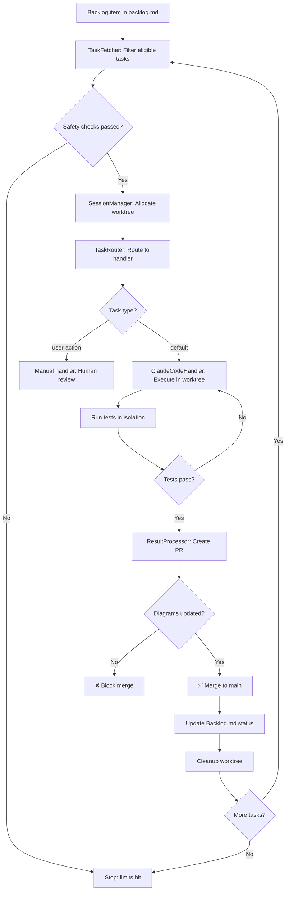

# SCAFFOLD Execution Flow

**Diagram Type:** Flowchart TD
**Purpose:** Visualize the SCAFFOLD autonomous development loop from Backlog → PR → Merge
**Update When:** Workflow changes, new handlers added, routing logic modified

## Diagram

## Key Decision Points

1. **Safety Checks** (Node C)
   - Max cost limit: $5.00
   - Max time limit: 4 hours
   - Max consecutive failures: 3
   - Max concurrent tasks: 3

2. **Task Routing** (Node F)
   - `user-action` label → Manual handler (human required)
   - Default → ClaudeCodeHandler (autonomous)

3. **Test Validation** (Node J)
   - Retry on failure (up to 3 attempts)
   - Isolated worktree prevents contamination

4. **Diagram Synchronization** (Node L) ⚠️ **CRITICAL ENFORCEMENT POINT**
   - Blocks merge if diagrams not updated
   - Detects new modules, state changes, data model changes
   - Enforces diagram-code synchronization

## Flow States

- **Node A:** Task eligible (status="To Do", dependencies satisfied)
- **Node D:** Worktree allocated (1 of max 3 concurrent)
- **Node H:** Code execution in isolated environment
- **Node K:** PR created with diagram checklist
- **Node L:** Diagram validation gate (automated + manual)
- **Node O:** Backlog.md status → "Done"
- **Node P:** Worktree cleanup, resources released

## Related Diagrams

- See `02-architecture.md` for module structure
- See `03-orchestrator-states.md` for detailed state machine
