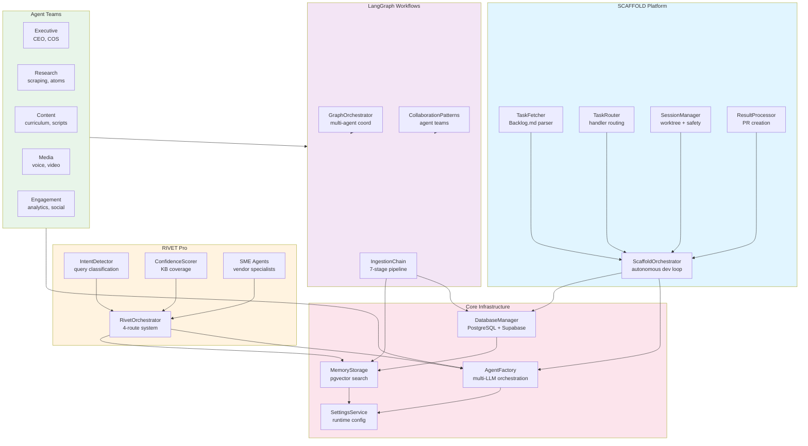

# Agent Factory Architecture

**Diagram Type:** Module Dependency Graph
**Purpose:** High-level system architecture showing module relationships and integration points
**Update When:** New module/package added, dependencies change, integration points added

## Diagram

## Module Descriptions

### Core Infrastructure

- **AgentFactory**: Multi-LLM orchestration layer (Claude, GPT-4, Gemini)
- **DatabaseManager**: Multi-provider PostgreSQL (Neon, Supabase, Railway)
- **MemoryStorage**: pgvector semantic search + hybrid retrieval
- **SettingsService**: Runtime configuration (database-backed, .env fallback)

### SCAFFOLD Platform

- **ScaffoldOrchestrator**: Autonomous development loop coordinator
- **TaskFetcher**: Backlog.md parser with dependency resolution
- **TaskRouter**: Route tasks to handlers (claude-code, manual)
- **SessionManager**: Worktree allocation + safety monitoring
- **ResultProcessor**: PR creation + Backlog.md synchronization

### RIVET Pro

- **RivetOrchestrator**: 4-route industrial maintenance routing
- **IntentDetector**: Query classification (vendor, category, complexity)
- **ConfidenceScorer**: Knowledge base coverage analysis
- **SME Agents**: Vendor-specific specialists (Rockwell, Siemens, etc.)

### LangGraph Workflows

- **IngestionChain**: 7-stage pipeline (Source → Atoms → Validation → Storage)
- **GraphOrchestrator**: Multi-agent workflow coordination
- **CollaborationPatterns**: Agent team patterns (research, content, media)

### Agent Teams

- **Executive**: AI CEO, Chief of Staff (strategy, KPIs)
- **Research**: Research Agent, Atom Builder, Quality Checker
- **Content**: Curriculum Designer, Scriptwriter, SEO Agent
- **Media**: Voice Production, Video Assembly, YouTube Uploader
- **Engagement**: Analytics Agent, Community Manager, Social Amplifier

## External Dependencies

- **MCP Servers**: Backlog.md, GitHub, Playwright, Memory
- **Supabase**: PostgreSQL 16 + pgvector + Auth
- **Neon/Railway**: Alternative database providers
- **VPS (Hostinger)**: 24/7 knowledge base ingestion (Redis queue + Ollama)
- **ElevenLabs**: Voice clone for autonomous narration
- **LangChain/LangGraph**: Workflow orchestration

## Related Diagrams

- See `01-execution-flow.md` for SCAFFOLD workflow
- See `03-orchestrator-states.md` for state machine
- See `05-data-model.md` for entity relationships
