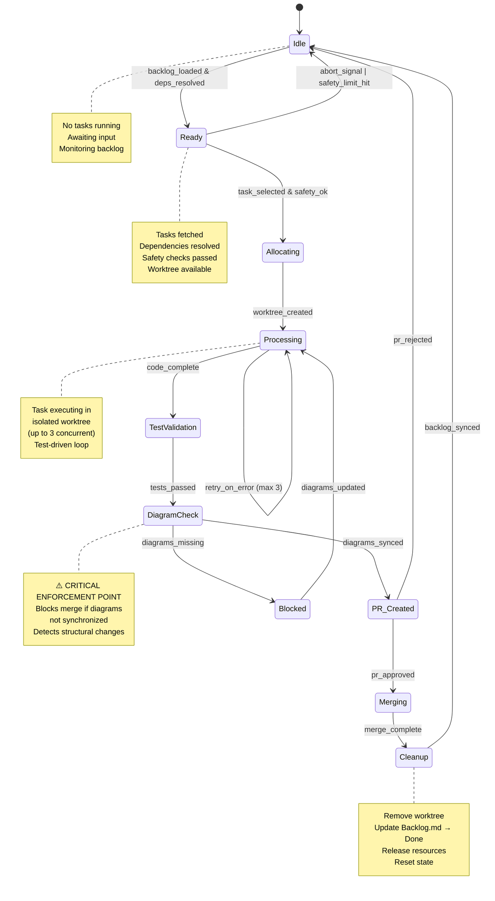

# SCAFFOLD Orchestrator State Machine

**Diagram Type:** State Diagram v2
**Purpose:** SCAFFOLD orchestrator lifecycle with state transitions and conditions
**Update When:** State transitions change, new states added, safety checks modified

## Diagram

## State Descriptions

### Idle
- **Entry**: Initial state or after task completion
- **Activities**: Monitor Backlog.md for new tasks
- **Exit**: Backlog loaded and dependencies resolved

### Ready
- **Entry**: Tasks fetched from Backlog.md
- **Activities**:
  - Validate safety limits (cost, time, failures)
  - Check worktree availability (max 3 concurrent)
  - Select next task by priority score
- **Exit**: Task selected and safety checks passed

### Allocating
- **Entry**: Task selected, safety OK
- **Activities**:
  - Create git worktree
  - Initialize session tracking
  - Set up isolated environment
- **Exit**: Worktree created successfully

### Processing
- **Entry**: Worktree allocated
- **Activities**:
  - Execute ClaudeCodeHandler
  - Run code generation loop
  - Retry on errors (max 3 attempts)
  - Monitor cost and time budgets
- **Exit**: Code complete and ready for testing

### TestValidation
- **Entry**: Code generation complete
- **Activities**:
  - Run tests in isolated worktree
  - Validate acceptance criteria
  - Check for regressions
- **Exit**: All tests pass
- **Retry**: Return to Processing if tests fail (max 3 retries)

### DiagramCheck ⚠️
- **Entry**: Tests passed
- **Activities**:
  - Detect new Python modules/packages
  - Check if architecture diagram updated
  - Detect dataclass/schema changes
  - Check if data model diagram updated
  - Detect state machine changes
  - Check if state diagram updated
- **Exit**: Diagrams synchronized OR blocked
- **Enforcement**: Cannot proceed to PR_Created if diagrams missing

### Blocked
- **Entry**: Diagrams not synchronized
- **Activities**:
  - Add PR comment with required diagram updates
  - Wait for diagram updates
  - Notify user
- **Exit**: Diagrams updated, return to Processing

### PR_Created
- **Entry**: Diagrams synchronized
- **Activities**:
  - Create GitHub PR with ResultProcessor
  - Include diagram checklist in PR description
  - Tag relevant reviewers
- **Exit**: PR approved OR rejected

### Merging
- **Entry**: PR approved
- **Activities**:
  - Merge to main branch
  - Trigger post-merge hooks
  - Update roadmap timeline diagram
- **Exit**: Merge complete

### Cleanup
- **Entry**: Merge complete OR PR rejected
- **Activities**:
  - Remove worktree
  - Update Backlog.md status → "Done"
  - Release resources (cost tracking, session)
  - Log metrics
- **Exit**: Backlog synchronized

## Transition Conditions

### backlog_loaded & deps_resolved
- Backlog.md queried via MCP
- Tasks with status="To Do" found
- All dependencies have status="Done"

### task_selected & safety_ok
- Task selected by priority score
- Cost budget available (< $5.00 session limit)
- Time budget available (< 4 hours session limit)
- No consecutive failure limit hit (< 3)

### worktree_created
- Git worktree allocated successfully
- Branch created: `scaffold/task-{id}`
- Session tracking initialized

### code_complete
- ClaudeCodeHandler finished execution
- No unhandled exceptions
- Changes committed to worktree

### tests_passed
- All acceptance criteria tests pass
- No regressions detected
- Isolated test environment clean

### diagrams_synced
- Architecture diagram updated if new modules added
- Data model diagram updated if schema changed
- State diagram updated if transitions changed
- Roadmap diagram updated if milestone reached

### diagrams_missing
- Structural changes detected (new modules, schema changes)
- Corresponding diagrams NOT updated
- Enforcement: Block PR creation

### diagrams_updated
- Human or agent updated required diagrams
- DiagramCheck re-validation passed

### pr_approved / pr_rejected
- Human reviewer approved/rejected PR
- GitHub PR status updated

### merge_complete
- PR merged to main successfully
- Post-merge hooks completed

### backlog_synced
- Backlog.md status updated to "Done"
- Implementation notes added
- Session metrics logged

### abort_signal | safety_limit_hit
- User manually aborted session
- OR cost limit exceeded
- OR time limit exceeded
- OR consecutive failure limit hit

## Related Diagrams

- See `01-execution-flow.md` for complete workflow
- See `02-architecture.md` for SessionManager module
- See `05-data-model.md` for SESSION entity
