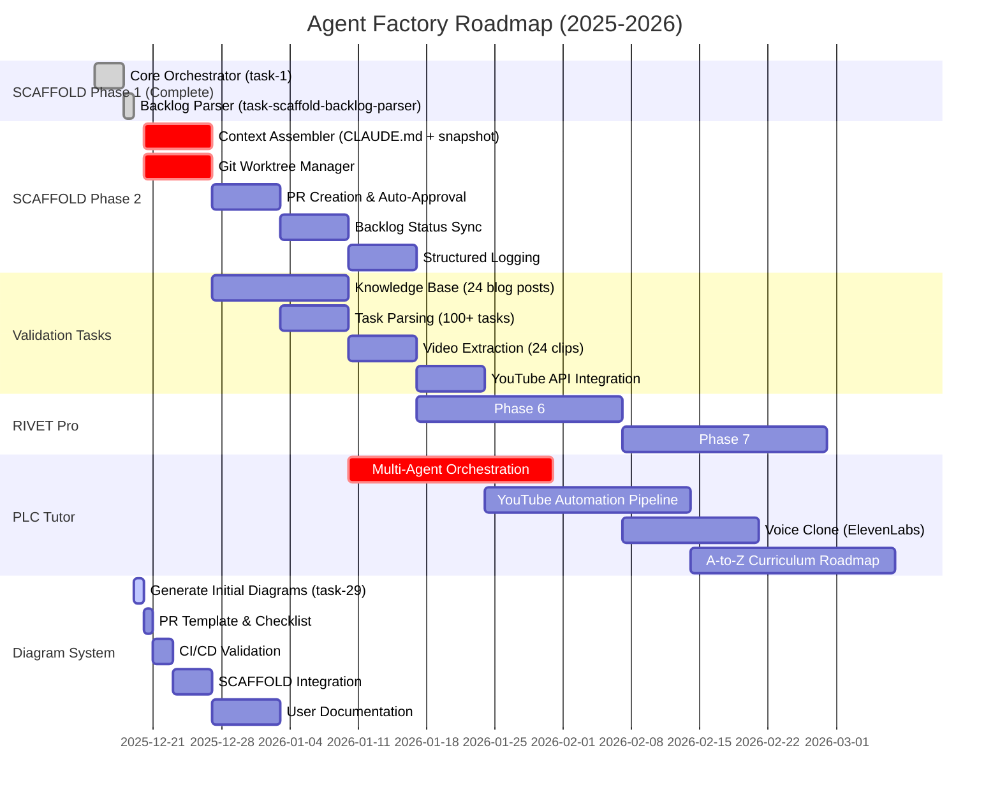

# Agent Factory Roadmap Timeline

**Diagram Type:** Gantt Chart
**Purpose:** Feature roadmap from Backlog.md with milestones and delivery phases
**Update When:** Task completed (mark `done`), major milestone reached, timeline changes

## Diagram

## Milestones

### ✅ SCAFFOLD Phase 1 Complete (Dec 19, 2025)
- Core orchestrator implemented (task-1)
- Backlog parser with MCP integration (task-scaffold-backlog-parser)
- 26 unit tests passing
- Foundation for autonomous development established

### 🎯 SCAFFOLD Phase 2 (Dec 20 - Jan 17, 2026)
- **Critical Path**: Context Assembler + Worktree Manager (enables autonomous code generation)
- **Follow-on**: PR creation, Backlog sync, structured logging
- **Goal**: Fully autonomous development loop operational

### 🎯 Diagram System (Dec 19 - Jan 3, 2026)
- **Active**: Generate initial diagrams (task-29)
- **Next**: PR template with mandatory checklist
- **Follow-on**: CI/CD validation, SCAFFOLD integration, user docs
- **Goal**: Living documentation synchronized with code

### 🎯 RIVET Pro (Jan 17 - Feb 28, 2026)
- **Phase 6**: Structured logging and observability
- **Phase 7**: REST API + webhook integrations
- **Goal**: Production-ready industrial maintenance platform

### 🎯 PLC Tutor (Jan 10 - Mar 7, 2026)
- **Critical**: Multi-agent orchestration (18 agents)
- **Content**: YouTube automation + voice clone
- **Curriculum**: A-to-Z roadmap (electricity → AI automation)
- **Goal**: Autonomous educational content generation

## Timeline Summary

- **Week 1 (Dec 15-19)**: SCAFFOLD Phase 1 ✅
- **Week 2-5 (Dec 20 - Jan 17)**: SCAFFOLD Phase 2 + Diagram System
- **Week 6-9 (Jan 17 - Feb 14)**: RIVET Pro Phase 6-7 + PLC Tutor kickoff
- **Week 10-13 (Feb 14 - Mar 7)**: PLC Tutor content pipeline + curriculum

## Dependencies

**SCAFFOLD Phase 2** depends on:
- Phase 1 complete ✅
- Backlog parser operational ✅
- Git worktrees available ✅

**Diagram System** depends on:
- Repository structure stable (ongoing)
- PR template enforcement (Dec 20)
- CI/CD validation (Dec 21)

**RIVET Pro Phase 6-7** depends on:
- Knowledge base seeded (validation tasks)
- Agent orchestration (SCAFFOLD Phase 2)
- Database schema stable (Q1 2026)

**PLC Tutor** depends on:
- 18-agent system design complete ✅
- YouTube-Wiki strategy approved ✅
- Voice clone ready (ElevenLabs setup)
- Content roadmap A-to-Z complete ✅

## Related Diagrams

- See `01-execution-flow.md` for SCAFFOLD workflow
- See `02-architecture.md` for module dependencies
- See `06-knowledge-map.md` for strategic priorities
