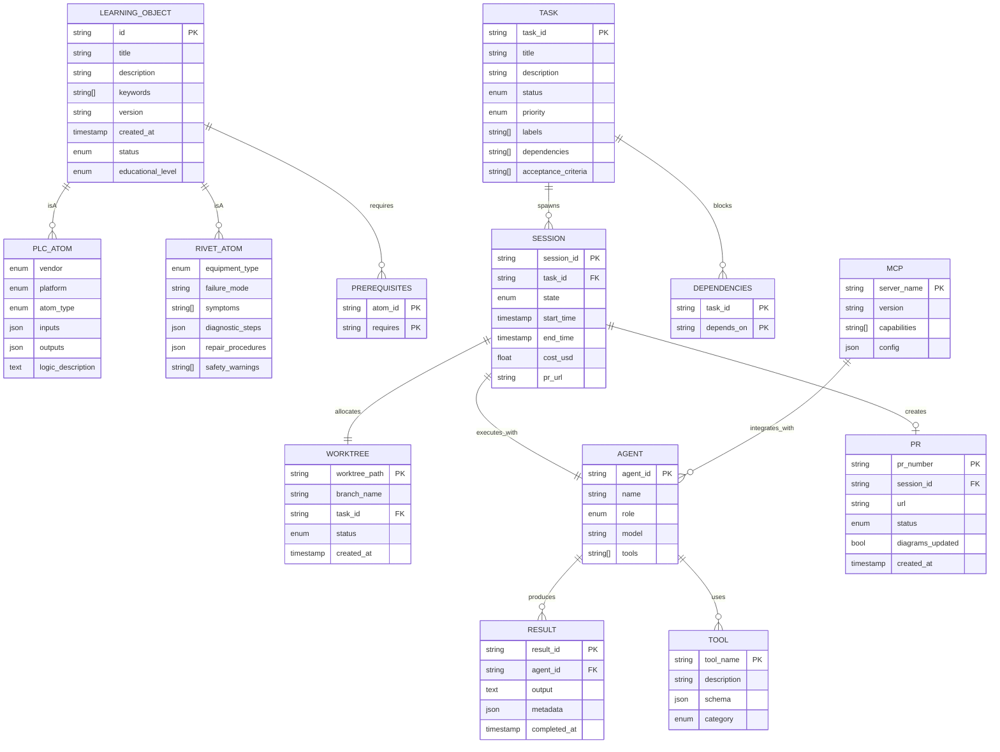

# Agent Factory Data Model

**Diagram Type:** ER Diagram (Entity-Relationship)
**Purpose:** Core entities and relationships in Agent Factory system
**Update When:** New entity added (class/dataclass), relationship changes, key fields modified, schema migration

## Diagram

## Entity Descriptions

### LEARNING_OBJECT (Base)
- **Purpose**: Universal knowledge atom standard (IEEE LOM-based)
- **Subtypes**: PLCAtom, RIVETAtom
- **Storage**: Supabase `knowledge_atoms` table
- **Search**: pgvector embeddings for semantic search

### PLC_ATOM (Extends LEARNING_OBJECT)
- **Purpose**: PLC programming knowledge (patterns, faults, procedures)
- **Vendors**: Allen-Bradley, Siemens, Mitsubishi, Omron, Schneider
- **Platforms**: ControlLogix, CompactLogix, S7-1200, S7-1500, etc.
- **Types**: `concept`, `pattern`, `fault`, `procedure`

### RIVET_ATOM (Extends LEARNING_OBJECT)
- **Purpose**: Industrial maintenance knowledge (troubleshooting, repair)
- **Equipment**: Motors, PLCs, VFDs, sensors, pneumatics
- **Content**: Failure modes, symptoms, diagnostic steps, safety warnings

### TASK
- **Purpose**: Backlog.md task tracking
- **Status**: "To Do", "In Progress", "Done"
- **Priority**: "high", "medium", "low"
- **Labels**: "scaffold", "rivet-pro", "user-action", "critical", etc.
- **Source**: Backlog.md via MCP

### SESSION
- **Purpose**: SCAFFOLD orchestrator session tracking
- **State**: Idle, Ready, Allocating, Processing, TestValidation, DiagramCheck, PR_Created, Merging, Cleanup
- **Budgets**: Max cost ($5.00), max time (4h), max failures (3)
- **Lifecycle**: Created → Worktree allocated → PR created → Cleanup

### WORKTREE
- **Purpose**: Git worktree isolation for concurrent tasks
- **Status**: "active", "completed", "failed"
- **Branch**: `scaffold/task-{id}`
- **Max Concurrent**: 3 worktrees

### AGENT
- **Purpose**: Multi-LLM agent definitions
- **Roles**: Executive, Research, Content, Media, Engagement
- **Models**: Claude (Sonnet, Opus), GPT-4, Gemini
- **Tools**: MCP integrations, custom tools

### RESULT
- **Purpose**: Agent execution results
- **Content**: Output text, structured data, file paths
- **Metadata**: Cost, tokens, duration, model version

### TOOL
- **Purpose**: Tool registry for agents
- **Categories**: "search", "file", "code", "memory", "web"
- **Schema**: JSON Schema for parameters

### MCP
- **Purpose**: Model Context Protocol server integrations
- **Servers**: backlog, github, playwright, memory, filesystem
- **Capabilities**: Tools, resources, prompts

### PR
- **Purpose**: GitHub pull request tracking
- **Status**: "open", "merged", "closed"
- **diagrams_updated**: Boolean flag for enforcement
- **Lifecycle**: Created by ResultProcessor → Human review → Merge

## Relationships

### One-to-Many
- **TASK → SESSION**: One task spawns multiple retry sessions
- **SESSION → PR**: One session creates one PR (if successful)
- **AGENT → RESULT**: One agent produces many results
- **MCP → AGENT**: One MCP server integrates with many agents

### One-to-One
- **SESSION → WORKTREE**: One session allocates exactly one worktree
- **SESSION → AGENT**: One session executes with exactly one primary agent

### Many-to-Many
- **TASK → DEPENDENCIES**: Tasks can depend on multiple other tasks
- **LEARNING_OBJECT → PREREQUISITES**: Atoms can require multiple prerequisite atoms
- **AGENT → TOOL**: Agents can use multiple tools, tools can be used by multiple agents

## Key Constraints

1. **TASK.status** must be in ("To Do", "In Progress", "Done")
2. **SESSION.cost_usd** must be ≤ max_cost budget
3. **WORKTREE.status** = "active" implies SESSION.state in (Allocating, Processing, TestValidation, DiagramCheck)
4. **PR.diagrams_updated** = false blocks merge (enforced by DiagramCheck state)
5. **DEPENDENCIES.depends_on** must point to valid TASK.task_id
6. **PREREQUISITES.requires** must point to valid LEARNING_OBJECT.id

## Related Diagrams

- See `01-execution-flow.md` for TASK → SESSION → PR flow
- See `02-architecture.md` for module structure
- See `03-orchestrator-states.md` for SESSION.state transitions
