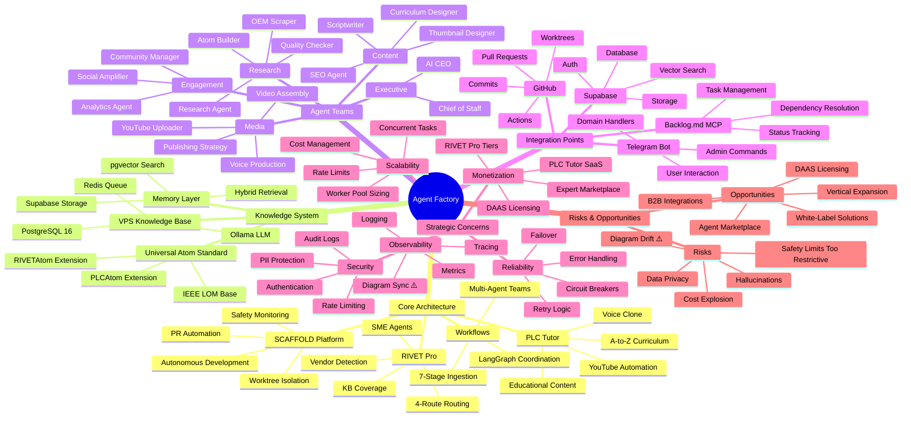

# Agent Factory Strategic Knowledge Map

**Diagram Type:** Mind Map
**Purpose:** Strategic concepts, subsystems, cross-cutting concerns, risks, and opportunities
**Update When:** New strategic initiative, major architecture change, new risk identified, opportunity discovered

## Diagram

## Strategic Concepts Explained

### Core Architecture

**SCAFFOLD Platform:**
- **Autonomous Development**: Self-improving codebase via Backlog → Code → Test → PR loop
- **Worktree Isolation**: Up to 3 concurrent tasks in isolated git worktrees
- **Safety Monitoring**: Cost ($5), time (4h), failure (3) limits prevent runaway execution
- **PR Automation**: Automated PR creation with diagram synchronization enforcement

**RIVET Pro:**
- **4-Route Routing**: Intent → Vendor → Confidence → SME routing system
- **Vendor Detection**: Classify queries by industrial vendor (Rockwell, Siemens, etc.)
- **KB Coverage**: Confidence scoring based on knowledge base completeness
- **SME Agents**: Vendor-specific specialists for deep technical queries

**PLC Tutor:**
- **Educational Content**: Structured curriculum (electricity → PLCs → automation → AI)
- **Voice Clone**: ElevenLabs Pro for autonomous narration (24/7 content generation)
- **YouTube Automation**: Scriptwriter → Voice → Video → Upload pipeline
- **A-to-Z Curriculum**: 100+ videos, prerequisite chains, progressive difficulty

**Workflows:**
- **LangGraph Coordination**: Multi-agent state machines (research → content → media → publish)
- **7-Stage Ingestion**: Source → Fetch → Parse → Validate → Atomize → Store → Index
- **Multi-Agent Teams**: Executive, Research, Content, Media, Engagement working together

### Knowledge System

**Universal Atom Standard:**
- **IEEE LOM Base**: Learning Object Metadata (title, description, keywords, level)
- **PLCAtom Extension**: Vendor, platform, inputs/outputs, logic patterns
- **RIVETAtom Extension**: Equipment, failure modes, diagnostic steps, safety warnings

**Memory Layer:**
- **Supabase Storage**: PostgreSQL 16 with pgvector for semantic search
- **pgvector Search**: 1536-dimensional embeddings (OpenAI text-embedding-3-small)
- **Hybrid Retrieval**: Keyword + semantic + metadata filtering

**VPS Knowledge Base (Hostinger 72.60.175.144):**
- **PostgreSQL 16**: 24/7 atom storage
- **Redis Queue**: Ingestion job queue (PDF URLs, YouTube URLs)
- **Ollama LLM**: deepseek-r1:1.5b + nomic-embed-text (FREE local inference)

### Agent Teams (18 Agents)

**Executive (2):**
1. AI CEO - Strategy, KPIs, resource allocation
2. Chief of Staff - Project management, issue tracking, orchestration

**Research (4):**
3. Research Agent - Web scraping, YouTube transcripts, PDF processing
4. OEM Scraper - Vendor documentation harvesting
5. Atom Builder - Convert raw data → structured atoms
6. Quality Checker - Validate accuracy, safety, citations

**Content (5):**
7. Master Curriculum Agent - A-to-Z roadmap, learning paths
8. Content Strategy Agent - Keyword research, topic selection
9. Scriptwriter Agent - Atoms → engaging scripts
10. SEO Agent - Optimize metadata, tags
11. Thumbnail Agent - Generate thumbnails, A/B testing

**Media (4):**
12. Voice Production Agent - ElevenLabs narration
13. Video Assembly Agent - Sync audio + visuals
14. Publishing Strategy Agent - Upload scheduling
15. YouTube Uploader Agent - Execute uploads, handle errors

**Engagement (3):**
16. Community Agent - Respond to comments, moderate
17. Analytics Agent - Track metrics, detect trends
18. Social Amplifier Agent - TikTok, Instagram, LinkedIn distribution

### Integration Points

**Backlog.md MCP:**
- Task list/view/edit operations
- Dependency resolution (prerequisites satisfied?)
- Status tracking (To Do → In Progress → Done)

**Telegram Bot:**
- Admin commands (/start, /help, /stats)
- Domain handlers (research, content, media, analytics)
- User interaction (questions, feedback, escalation)

**GitHub:**
- Worktree management (create, list, remove)
- Pull request automation (create, review, merge)
- Commit history tracking
- GitHub Actions (CI/CD validation)

**Supabase:**
- PostgreSQL database (tasks, sessions, agents, atoms)
- Authentication (user management, API keys)
- Storage (files, media, embeddings)
- pgvector search (semantic retrieval)

### Strategic Concerns

**Scalability:**
- **Concurrent Tasks**: Max 3 worktrees (prevents resource exhaustion)
- **Rate Limits**: OpenAI 10k RPM, ElevenLabs 100k chars/month
- **Worker Pool Sizing**: Balance cost vs. throughput
- **Cost Management**: $5/session safety limit

**Reliability:**
- **Error Handling**: Try/except blocks, graceful degradation
- **Retry Logic**: Max 3 retries with exponential backoff
- **Failover**: Multi-provider database (Neon, Supabase, Railway)
- **Circuit Breakers**: Stop execution if repeated failures

**Observability:**
- **Logging**: Structured logs (JSON), centralized aggregation
- **Metrics**: Cost, duration, tokens, success/failure rates
- **Tracing**: Session tracking, agent execution paths
- **Diagram Sync ⚠️**: Mandatory synchronization enforcement

**Security:**
- **Authentication**: API keys, token-based auth
- **Rate Limiting**: Prevent abuse, DDoS protection
- **Audit Logs**: Who did what, when (compliance requirement)
- **PII Protection**: Scrub sensitive data from logs/outputs

**Monetization:**
- **RIVET Pro Tiers**: Free (community) → Pro ($49/mo) → Enterprise ($299/mo)
- **PLC Tutor SaaS**: Basic ($29/mo) → Pro ($99/mo) → Organization ($10K/year)
- **DAAS Licensing**: Data-as-a-Service (sell knowledge atoms)
- **Expert Marketplace**: Connect users with human experts ($50-$100/call)

### Risks & Opportunities

**Risks:**
- **Diagram Drift ⚠️**: Code changes without diagram updates → outdated documentation
  - *Mitigation*: PR checklist + CI/CD validation + periodic audits
- **Safety Limits Too Restrictive**: $5 budget blocks complex tasks
  - *Mitigation*: Configurable limits, user override option
- **Cost Explosion**: Runaway agent loops consume budget
  - *Mitigation*: Max retries (3), time limits (4h), cost tracking
- **Hallucinations**: LLMs generate incorrect technical info
  - *Mitigation*: Knowledge atoms validated against official docs
- **Data Privacy**: User queries contain proprietary info
  - *Mitigation*: PII scrubbing, encryption at rest, audit logs

**Opportunities:**
- **Vertical Expansion**: Apply to HVAC, electrical, automotive, etc.
  - *Value*: Same platform, new domains → incremental revenue
- **DAAS Licensing**: Sell validated knowledge atoms to competitors
  - *Value*: Passive income, no marginal cost
- **Agent Marketplace**: Sell custom agents to enterprises
  - *Value*: High-margin SaaS ($299-$999/mo per agent)
- **B2B Integrations**: Embed into CMMS platforms (ServiceTitan, MaintainX)
  - *Value*: Enterprise contracts ($10K-$100K/year)
- **White-Label Solutions**: License entire platform to OEMs
  - *Value*: Upfront licensing fees ($50K-$500K)

## Related Diagrams

- See `01-execution-flow.md` for SCAFFOLD workflow
- See `02-architecture.md` for module structure
- See `04-roadmap-timeline.md` for implementation timeline
